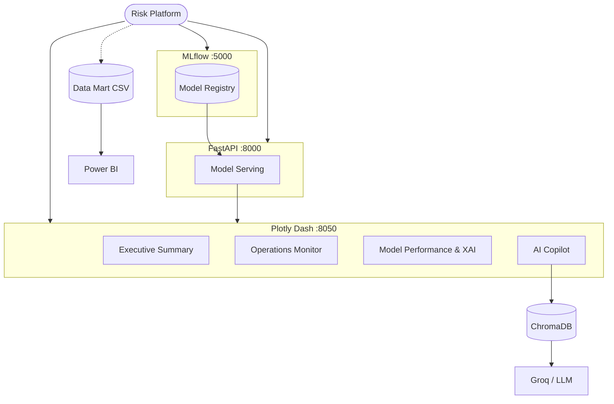

# Panduan Sistem Operasional (HOW_TO_RUN)

Panduan teknis untuk mengonfigurasi, menjalankan, dan menguji **Risk — Enterprise Fraud Analytics & Intelligence System**. Tersedia dua metode:

| Metode | Kapan digunakan |
| --- | --- |
| **Docker Compose** | Direkomendasikan. Menjalankan seluruh layanan secara terintegrasi dan konsisten. |
| **Manual Development** | Pengembangan aktif, debugging, dan *hot-reload*. |

## Daftar Isi

1. [Prasyarat Sistem](#1-prasyarat-sistem)
2. [Instalasi dan Konfigurasi](#2-instalasi-dan-konfigurasi)
3. [Opsi A: Docker Compose](#3-opsi-a-docker-compose)
4. [Opsi B: Manual Development](#4-opsi-b-manual-development)
5. [Pengujian dan Validasi Kode](#5-pengujian-dan-validasi-kode)
6. [Pembuatan Data Mart Power BI](#6-pembuatan-data-mart-power-bi)
7. [Troubleshooting](#7-troubleshooting)
8. [Arsitektur Layanan](#8-arsitektur-layanan)
9. [Referensi Cepat](#9-referensi-cepat)
10. [Catatan Keamanan](#10-catatan-keamanan)

---

## 1. Prasyarat Sistem

| Kebutuhan | Keterangan | Wajib untuk |
| --- | --- | --- |
| **Python 3.10+** | Runtime aplikasi | Mode Manual |
| **Git** | Kloning repositori | Semua mode |
| **Docker & Docker Compose** | Deployment berbasis container | Mode Docker |
| **Akses internet** | Instalasi dependency dan API eksternal | Semua mode |
| **Groq API Key** | Mesin LLM untuk AI Copilot | AI Copilot |
| **LangSmith API Key** | Monitoring dan tracing RAG | Opsional |

---

## 2. Instalasi dan Konfigurasi

### 2.1. Kloning Repositori

```bash
git clone https://github.com/username/credit-card-fraud-ml.git
cd credit-card-fraud-ml
```

> Ganti URL dengan URL repositori aktual apabila berbeda.

### 2.2. Konfigurasi Environment Variables

Buat file `.env` di **root directory**, sejajar dengan `README.md`:

```text
credit-card-fraud-ml/
├── .env
├── README.md
├── docker-compose.yml
├── dashboard/
├── dataset/
├── knowledge_base/
├── models/
├── report/
└── tests/
```

Isi file `.env`:

```env
# ==========================================
# FastAPI Authentication
# ==========================================
API_SECRET_KEY=masukkan_kunci_rahasia_jwt_anda_di_sini

# ==========================================
# AI Copilot - Groq
# ==========================================
GROQ_API_KEY=masukkan_kunci_api_groq_anda

# ==========================================
# MLOps - MLflow
# ==========================================
MLFLOW_TRACKING_URI=http://localhost:5000

# ==========================================
# LangSmith - RAG Monitoring (opsional)
# ==========================================
LANGCHAIN_TRACING_V2=true
LANGCHAIN_ENDPOINT=https://api.smith.langchain.com
LANGCHAIN_API_KEY=masukkan_kunci_api_langsmith_anda
LANGCHAIN_PROJECT=Risk_Production
```

**Keamanan:** Jangan pernah melakukan commit file `.env`. Pastikan file tersebut terdaftar di `.gitignore`:

> ```gitignore
> .env
> *.env
> ```

---

## 3. Opsi A: Docker Compose

### 3.1. Build dan Jalankan Layanan

Dari **root directory**:

```bash
docker compose up -d --build
```

> Pada Docker versi lama, gunakan `docker-compose` sebagai alternatif.

Layanan yang tersedia setelah proses selesai:

| Layanan | URL |
| --- | --- |
| **Dash Operational Dashboard** | http://localhost:8050 |
| **FastAPI Inference API** | http://localhost:8000 |
| **FastAPI Swagger UI** | http://localhost:8000/docs |
| **MLflow** | http://localhost:5000 |

### 3.2. Perintah Pengelolaan Container

| Tujuan | Perintah |
| --- | --- |
| Periksa status (harus `Up` / `Running`) | `docker compose ps` |
| Log seluruh layanan (real-time) | `docker compose logs -f` |
| Log layanan tertentu | `docker compose logs -f dashboard` |
| Hentikan layanan (container tetap ada) | `docker compose stop` |
| Jalankan kembali setelah `stop` | `docker compose start` |
| Hentikan dan hapus container + network | `docker compose down` |
| Hapus juga volume | `docker compose down -v` |

> Ganti `dashboard` dengan nama service di `docker-compose.yml`.
> Gunakan `-v` dengan hati-hati karena akan menghapus data pada Docker volumes.

---

## 4. Opsi B: Manual Development

### 4.1. Membuat Virtual Environment

Dari root directory.

**Windows**

```bash
python -m venv venv
venv\Scripts\activate
```

**Linux / macOS**

```bash
python3 -m venv venv
source venv/bin/activate
```

### 4.2. Instalasi Dependencies

```bash
pip install -r dashboard/05_Model_Serving/requirements.txt
pip install -r dashboard/06_Dashboard/requirements.txt
```

Tools pengujian dan code quality:

```bash
pip install pytest flake8 black mypy
```

### 4.3. Inisialisasi ChromaDB

AI Copilot memakai ChromaDB sebagai *vector store* untuk dokumen di `knowledge_base/`.

```bash
cd dashboard/06_Dashboard/core/
python build_vector_db.py
cd ../../../
```

> Jalankan ulang setiap kali ada dokumen baru di knowledge base.

### 4.4. Menjalankan Layanan

Gunakan **tiga terminal terpisah** agar seluruh layanan berjalan bersamaan.

#### Terminal 1: MLflow Server

Jalankan dari **root directory**:

```bash
mlflow server --host 127.0.0.1 --port 5000
```

Akses: http://localhost:5000

#### Terminal 2: FastAPI Model Serving

Jalankan dari **root directory**:

```bash
uvicorn dashboard.05_Model_Serving.app:app --host 0.0.0.0 --port 8000 --reload
```

Jika muncul error terkait module path (karena nama folder diawali angka), gunakan `--app-dir`:

```bash
uvicorn app:app --app-dir dashboard/05_Model_Serving --host 0.0.0.0 --port 8000 --reload
```

Akses: http://localhost:8000 (Swagger UI: http://localhost:8000/docs)

#### Terminal 3: Plotly Dash Dashboard

```bash
cd dashboard/06_Dashboard/
python app.py
```

Akses: http://localhost:8050

Modul yang tersedia:

* Executive Summary
* Operations Monitor
* Model Performance & XAI
* AI Copilot (RAG)

### 4.5. Urutan Eksekusi yang Direkomendasikan

```text
1. Aktifkan Virtual Environment
2. Install Dependencies
3. Build ChromaDB
4. Jalankan MLflow
5. Jalankan FastAPI
6. Jalankan Dash
7. Jalankan Tests
```

---

## 5. Pengujian dan Validasi Kode

Jalankan seluruh perintah berikut dari **root directory** sebelum commit, agar sesuai dengan pipeline CI/CD.

| Tahap | Perintah |
| --- | --- |
| **Unit test** | `pytest tests/ -v` |
| **Cek format (Black)** | `black --check dashboard/ tests/` |
| **Format otomatis (Black)** | `black dashboard/ tests/` |
| **Static analysis (Flake8)** | `flake8 dashboard/ tests/ --count --select=E9,F63,F7,F82 --show-source --statistics` |
| **Type checking (MyPy)** | `mypy dashboard/ tests/ --ignore-missing-imports` |

---

## 6. Pembuatan Data Mart Power BI

Script `report/export_powerbi.py` mengekstrak data operasional menjadi Data Mart untuk Power BI.

```bash
python report/export_powerbi.py
```

| Item | Lokasi |
| --- | --- |
| **Output** | `dataset/03_powerbi/powerbi_fraud_mart.csv` |
| **Dipakai oleh** | `report/Fraud_Analytics_Report.pbix` |

---

## 7. Troubleshooting

| Masalah | Pemeriksaan dan Solusi |
| --- | --- |
| **MLflow tidak dapat diakses** | Pastikan server berjalan: `mlflow server --host 127.0.0.1 --port 5000`, lalu buka http://localhost:5000. |
| **FastAPI tidak dapat diakses** | Pastikan layanan berjalan di port `8000`, lalu cek http://localhost:8000/docs. Pada Docker, periksa `docker compose logs -f`. |
| **AI Copilot tidak berfungsi** | Pastikan `GROQ_API_KEY` terisi di `.env`, folder `chroma_db/` sudah ada, dan jalankan `python build_vector_db.py` bila belum. |
| **Dashboard tidak menampilkan data** | Periksa: dataset di `dataset/`, model di `models/`, FastAPI di port `8000`, MLflow di port `5000`, environment variables, dan ChromaDB (jika memakai AI Copilot). |

---

## 8. Arsitektur Layanan



---

## 9. Referensi Cepat

### Checklist Komponen

| Komponen | Mode | Verifikasi |
| --- | --- | --- |
| Python | Manual | `python --version` |
| Git | Semua | `git --version` |
| Docker | Docker | `docker --version` |
| Docker Compose | Docker | `docker compose version` |
| Virtual Environment | Manual | `venv\Scripts\activate` |
| MLflow | Semua | http://localhost:5000 |
| FastAPI | Semua | http://localhost:8000 |
| Swagger UI | Semua | http://localhost:8000/docs |
| Plotly Dash | Semua | http://localhost:8050 |
| ChromaDB | RAG | folder `chroma_db/` |
| Groq API | AI Copilot | `GROQ_API_KEY` di `.env` |
| LangSmith | Opsional | `LANGCHAIN_API_KEY` di `.env` |

### Ringkasan Perintah

| Fungsi | Perintah |
| --- | --- |
| Clone repository | `git clone <repository-url>` |
| Buat venv | `python -m venv venv` |
| Aktifkan venv (Windows) | `venv\Scripts\activate` |
| Install Model Serving | `pip install -r dashboard/05_Model_Serving/requirements.txt` |
| Install Dashboard | `pip install -r dashboard/06_Dashboard/requirements.txt` |
| Build ChromaDB | `python build_vector_db.py` |
| Jalankan MLflow | `mlflow server --host 127.0.0.1 --port 5000` |
| Jalankan FastAPI | `uvicorn dashboard.05_Model_Serving.app:app --host 0.0.0.0 --port 8000 --reload` |
| Jalankan Dashboard | `python app.py` |
| Jalankan Docker | `docker compose up -d --build` |
| Hentikan Docker | `docker compose stop` |
| Mulai ulang Docker | `docker compose start` |
| Hapus layanan Docker | `docker compose down` |
| Jalankan tests | `pytest tests/ -v` |
| Cek Black | `black --check dashboard/ tests/` |
| Jalankan Flake8 | `flake8 dashboard/ tests/` |
| Jalankan MyPy | `mypy dashboard/ tests/ --ignore-missing-imports` |
| Generate Data Mart Power BI | `python report/export_powerbi.py` |

---

## 10. Catatan Keamanan

Jangan menyimpan credential langsung di source code. Simpan melalui environment variables atau secret management:

```text
API_SECRET_KEY
GROQ_API_KEY
LANGCHAIN_API_KEY
```

Pastikan `.env` tercantum di `.gitignore`:

```gitignore
.env
*.env
```

> **Jangan pernah melakukan commit API key, JWT secret, atau credential lainnya ke repository.**

---

<div align="center">

**Risk — Enterprise Fraud Analytics & Intelligence System**

*Data Science · Machine Learning · MLOps · Explainable AI · RAG · Business Intelligence*

© 2026 Bayu Ardiyansyah

</div>