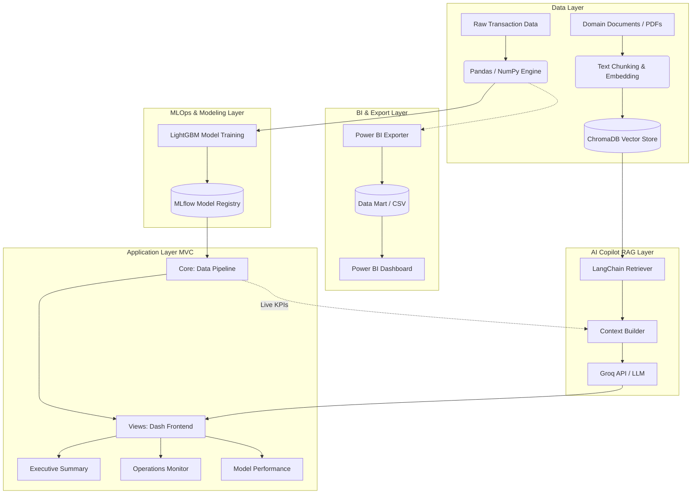

<div align="center">
  

# Enterprise Fraud Analytics & Intelligence System (Risk)

**Sistem Deteksi Penipuan Kartu Kredit Terintegrasi dengan Machine Learning (LightGBM), MLOps, dan Retrieval-Augmented Generation (RAG) AI.**

[](https://www.python.org/)
[](https://dash.plotly.com/)
[](https://lightgbm.readthedocs.io/)
[](https://mlflow.org/)
[](https://groq.com/)
[](https://github.com/features/actions)
</div>

---

## Ringkasan Proyek

Risk adalah platform intelijen prediktif yang dirancang untuk memitigasi kerugian finansial akibat transaksi kartu kredit yang tidak sah. Sistem ini memproses data logistik dan transaksi mentah menjadi metrik operasional, memungkinkan transisi dari mesin berbasis aturan (rule-based) yang statis menuju manajemen risiko berbasis model probabilitas probabilistik.

Platform ini memfasilitasi kebutuhan tiga pemangku kepentingan utama: visualisasi dampak finansial (Net Savings dan ROI) untuk level eksekutif, pemantauan anomali geospasial real-time untuk tim operasional, dan transparansi algoritma (Explainable AI) untuk tim audit dan data science.

---

## Alur Kerja dan Arsitektur Sistem

Pipeline sistem dibangun menggunakan arsitektur Model-View-Controller (MVC) terpisah untuk memastikan skalabilitas dari pemrosesan data hingga inferensi kecerdasan buatan:



---

## Kemampuan Utama

| Domain | Deskripsi Fitur |
| --- | --- |
| **Executive Reporting** | Dasbor metrik finansial untuk memantau *Total Processed Value* (TPV), *Net ROI*, kerugian yang berhasil dicegah, dan analisis demografi korban. Didukung oleh ekspor otomatis ke format Data Mart Power BI. |
| **Operations Monitor** | Peta distribusi anomali geospasial menggunakan kalkulasi jarak Haversine secara real-time, tren waktu transaksi, dan antrean investigasi berurutan untuk tim analis. |
| **Machine Learning Engine** | Mesin prediktif berbasis **LightGBM** yang dikalibrasi khusus untuk data imbalanced (0.58% rasio fraud). Termasuk pelacakan siklus hidup model melalui **MLflow**. |
| **AI Copilot (RAG)** | Asisten virtual operasional bertenaga **Groq** dan **LangChain**. Menggunakan *ChromaDB* untuk mencari referensi dokumen internal (POJK, Visa Rules) guna memandu keputusan investigasi. |
| **Explainable AI (XAI)** | Implementasi **SHAP** untuk transparansi model kotak hitam (black-box), memetakan bobot fitur secara global maupun pada tingkat transaksi individual. |

---

## Analisis Data dan Performa Machine Learning

### 1. Ketidakseimbangan Kelas (Class Imbalance)

Sistem ini menangani ketidakseimbangan kelas yang ekstrem pada data transaksi historis. Transaksi sah mendominasi sebesar 99.42%, sementara kasus penipuan hanya mencakup 0.58% dari 1,296,675 total populasi data.

### 2. Evaluasi Model (A/B Testing & MLOps)

Pengembangan model mencakup pengujian signifikansi statistik (McNemar's Test) antara LightGBM (Baseline) dan XGBoost (Challenger). Hasil pengujian mengonfirmasi signifikansi performa (p-value: 1.25e-56), menetapkan LightGBM sebagai model produksi final.

* **Optimal Threshold:** 0.9741 (Dikalibrasi untuk meminimalkan beban operasional / False Positives).
* **Precision:** 91.0%.
* **Recall:** 77.0%.
* **F1-Score:** 0.84.
* **PR-AUC:** 0.9258.

### 3. Audit Algoritma (SHAP)

Transparansi keputusan diverifikasi melalui plot SHAP. Secara global, model bergantung pada anomali nilai transaksi (`amt`), kategori pekerjaan (`job`), dan waktu (`transaction_hour`) untuk mendeteksi penipuan, meminimalkan risiko diskriminasi berbasis demografi statis.

<table>
  <tr>
    <td align="center" width="50%">
      
      <br/><sub><b>Global Model Audit</b> (Feature Importance)</sub>
    </td>
    <td align="center" width="50%">
      
      <br/><sub><b>Local Audit</b> (Investigasi Transaksi Individual)</sub>
    </td>
  </tr>
</table>

---

## Tampilan Antarmuka (Operational UI)

Antarmuka web dibangun dengan arsitektur **Plotly Dash** modular yang memisahkan ruang lingkup analisis sesuai dengan profil pengguna akhir.

<table>
  <tr>
    <td align="center" width="50%">
      
      <br/><b>Executive Summary</b>
      <br/><sub>Visualisasi dampak finansial, metrik ROI, dan demografi korban secara makro.</sub>
    </td>
    <td align="center" width="50%">
      
      <br/><b>Operations Monitor</b>
      <br/><sub>Pemantauan anomali spasial/temporal dan antrean investigasi harian.</sub>
    </td>
  </tr>
  <tr>
    <td align="center" width="50%">
      
      <br/><b>Model Performance & XAI</b>
      <br/><sub>Evaluasi kinerja operasional algoritma klasifikasi dan analisis fitur.</sub>
    </td>
    <td align="center" width="50%">
      
      <br/><b>AI Copilot (RAG)</b>
      <br/><sub>Terminal asisten bertenaga LLM untuk navigasi kepatuhan dan SOP.</sub>
    </td>
  </tr>
</table>

---

## Laporan Power BI

Selain dasbor web, tersedia laporan Power BI (`report/Fraud_Analytics_Report.pbix`) dan versi PDF (`report/Fraud_Analytics_Report.pdf`).

<table>
  <tr>
    <td align="center" width="33%">
      
      <br/><sub>Halaman 1</sub>
    </td>
    <td align="center" width="33%">
      
      <br/><sub>Halaman 2</sub>
    </td>
    <td align="center" width="33%">
      
      <br/><sub>Halaman 3</sub>
    </td>
  </tr>
</table>

---

## Integrasi CI/CD dan Keamanan

Repositori ini menerapkan standar DevSecOps melalui **GitHub Actions** untuk memastikan integritas kode dan infrastruktur produksi:

* **Gitleaks (Security Scan):** Mencegah kebocoran rahasia statis dan API Keys (seperti `GROQ_API_KEY`).
* **Flake8 (Linter):** Memastikan format penulisan Python mematuhi standar PEP-8.
* **Pytest:** Menjalankan pengujian fungsional pada logika data pipeline dan Haversine.
* **Docker Containerization:** Membangun *image* terpisah untuk antarmuka Dash dan FastAPI, lalu didistribusikan ke GitHub Container Registry.

---

## Struktur Proyek

Repositori disusun menggunakan prinsip Separation of Concerns (SoC) untuk memfasilitasi skalabilitas arsitektur.

```text
credit-card-fraud-ml/
├── .github/workflows/          # Skrip CI/CD (Gitleaks, Lint, Pytest, Docker)
├── chroma_db/                  # Database vektor (Persist directory untuk RAG)
├── dashboard/                  # Antarmuka web MVC dan layanan API
│   ├── 05_Model_Serving/       # FastAPI REST endpoints
│   └── 06_Dashboard/           # Dash Application
│       ├── core/               # Logika data dan integrasi LLM LangChain
│       └── views/              # Komponen antarmuka (Executive, Operations, AI)
├── dataset/                    # Penyimpanan data terstruktur
│   ├── 01_raw/                 # Data historis mentah
│   ├── 02_processed/           # Data hasil rekayasa fitur (Parquet)
│   └── 03_powerbi/             # Data mart operasional untuk integrasi eksternal
├── docs/                       # Dokumentasi arsitektur, BRD, dan skema data
├── knowledge_base/             # Basis pengetahuan kepatuhan (PDF untuk RAG)
├── mlruns/                     # Repositori pelacakan eksperimen MLflow
├── models/                     # Artefak biner model LightGBM produksi
├── notebook/                   # Skrip penelitian (EDA, Preprocessing, A/B Testing, XAI)
├── report/                     # Laporan, skrip pengekspor Power BI, dan aset gambar
│   ├── export_powerbi.py
│   ├── Fraud_Analytics_Report.pbix
│   ├── Fraud_Analytics_Report.pdf
│   └── image/
│       ├── Logo.jpg
│       ├── Logo_NoBackGround.png
│       ├── Audit/              # Plot SHAP (global & lokal)
│       ├── experiments/        # Visual hasil EDA
│       ├── PowerBI/            # Tangkapan layar laporan Power BI
│       └── web-dashboard/      # Tangkapan layar antarmuka Dash
└── tests/                      # Modul pengujian fungsional unit (Pytest)
```

---

## Instalasi dan Konfigurasi

### Prasyarat

* Python 3.10+
* Akses API Key **Groq** aktif

### Langkah Menjalankan Aplikasi Lokal

1. **Kloning Repositori**

```bash
git clone https://github.com/username/credit-card-fraud-ml.git
cd credit-card-fraud-ml
```

2. **Instalasi Dependensi**

```bash
pip install -r dashboard/06_Dashboard/requirements.txt
```

3. **Konfigurasi Lingkungan (Environment Variables)**

Buat file `.env` di dalam direktori *root* (sejajar dengan file `README.md`):

```env
GROQ_API_KEY=kunci_api_groq_anda
MLFLOW_TRACKING_URI=http://localhost:5000
```

4. **Inisialisasi Database Vektor (Opsional untuk RAG)**

```bash
cd dashboard/06_Dashboard/core/
python build_vector_db.py
```

5. **Jalankan Aplikasi Server Dash**

```bash
cd dashboard/06_Dashboard/
python app.py
```

Akses antarmuka operasional pada `http://localhost:8050` melalui web browser.

---

## Referensi Dokumentasi Teknis

* **[Business Requirements Document (BRD)](docs/BUSINESS_REQUIREMENT.md)**: Spesifikasi metrik kesuksesan, KPI, dan target operasional.
* **[System Architecture](docs/SYSTEM_ARCHITECTURE.md)**: Detail tumpukan teknologi dan topologi layanan mikro.
* **[Model Card](docs/MODEL_CARD.md)**: Lembar fakta algoritma, metrik presisi, dan pertimbangan bias demografi.
* **[Data Dictionary](docs/DATA_DICTIONARY.md)**: Rincian skema data mentah dan proses rekayasa fitur (Haversine/Temporal).
* **[User Manual](docs/USER_MANUAL.md)**: Panduan instalasi dan operasional sistem secara mendetail.

---

<div align="center">

## Kontributor

**Bayu Ardiyansyah**

*Data Scientist & Machine Learning Engineer*


Proyek ini dilisensikan di bawah Lisensi MIT - lihat file [LICENSE](LICENSE) untuk detail.

© 2026 Bayu Ardiyansyah.

</div>