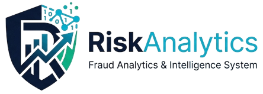
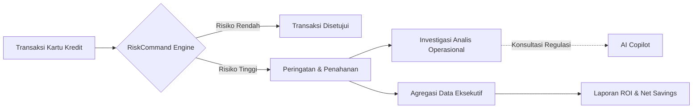
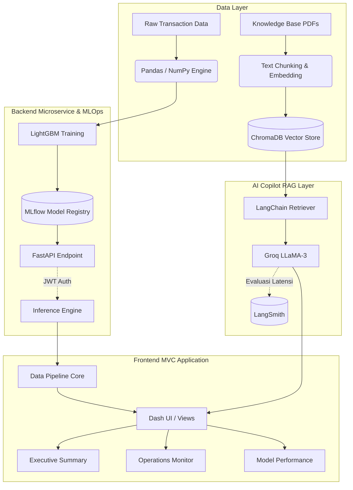
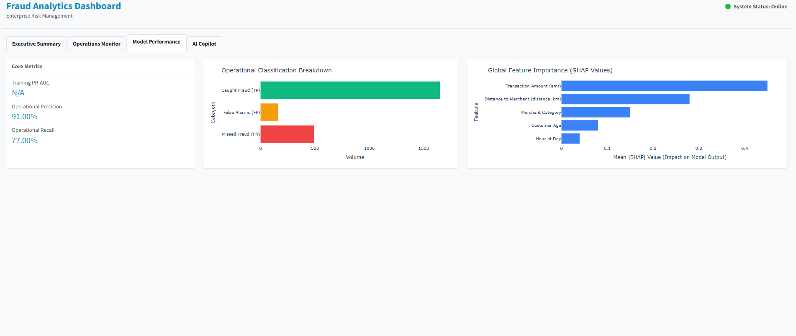
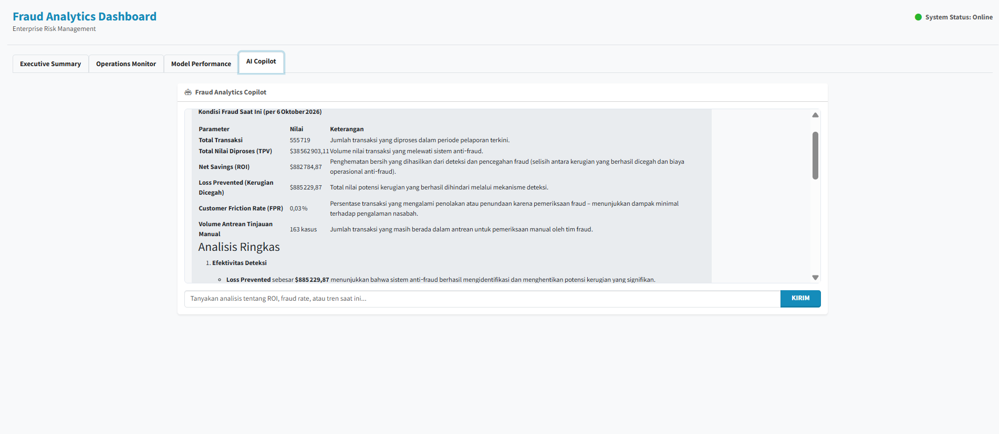
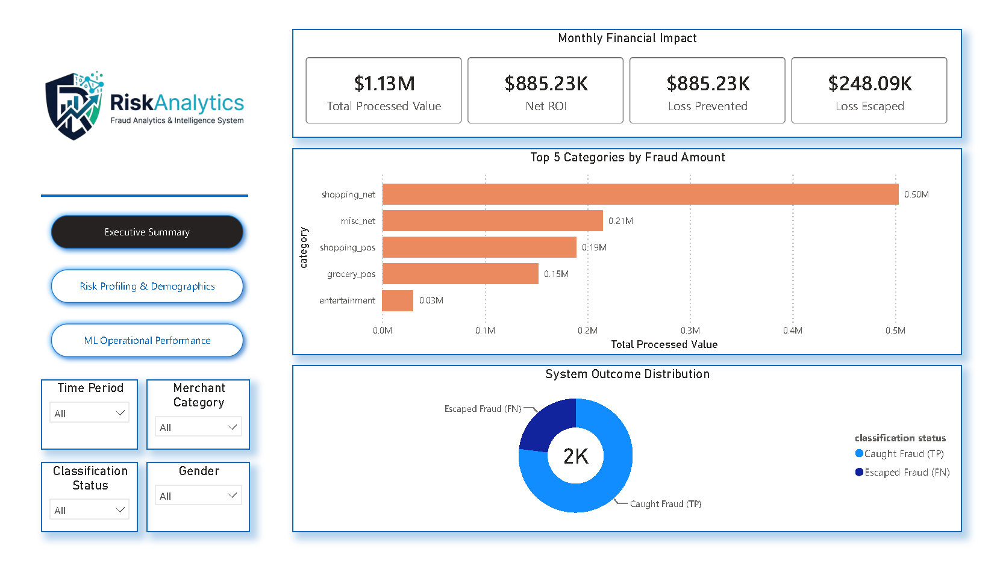
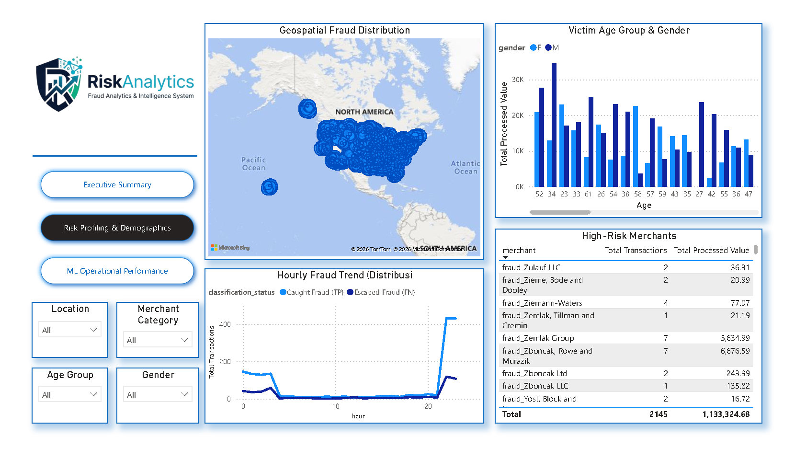
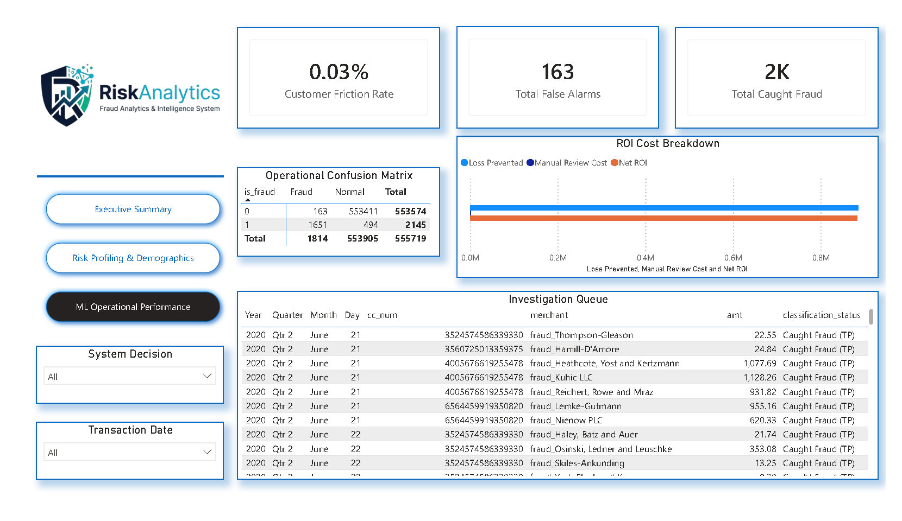

<div align="center">
  

# Enterprise Fraud Analytics & Intelligence System (RiskCommand)

**Sistem Deteksi Penipuan Kartu Kredit Terintegrasi dengan Machine Learning (LightGBM), MLOps, dan Retrieval-Augmented Generation (RAG) AI.**

[](https://www.python.org/)
[](https://dash.plotly.com/)
[](https://lightgbm.readthedocs.io/)
[](https://mlflow.org/)
[](https://groq.com/)
[](https://github.com/features/actions)
</div>

---

## Ringkasan Proyek

RiskCommand adalah platform intelijen prediktif yang dirancang untuk memitigasi kerugian finansial akibat transaksi kartu kredit yang tidak sah. Sistem ini memproses data logistik dan transaksi mentah menjadi metrik operasional, memungkinkan transisi dari mesin berbasis aturan (rule-based) yang statis menuju manajemen risiko berbasis model probabilitas.

Platform ini memfasilitasi tiga pemangku kepentingan utama: visualisasi dampak finansial (Net Savings dan ROI) untuk level eksekutif, pemantauan anomali geospasial real-time untuk tim operasional, dan transparansi algoritma (Explainable AI) untuk tim audit dan data science.

---

## Daftar Isi

1. [Alur Proses Bisnis](#1-alur-proses-bisnis-non-teknis)
2. [Arsitektur Sistem](#2-arsitektur-sistem-teknis)
3. [Analisis Data dan Performa Machine Learning](#3-analisis-data-dan-performa-machine-learning)
4. [Tampilan Antarmuka](#4-tampilan-antarmuka-operational-ui)
5. [Infrastruktur CI/CD dan Keamanan](#5-infrastruktur-cicd-dan-keamanan)
6. [Struktur Proyek](#6-struktur-proyek)
7. [Instalasi dan Konfigurasi](#7-instalasi-dan-konfigurasi)
8. [Referensi Dokumentasi](#8-referensi-dokumentasi)

---

## 1. Alur Proses Bisnis (Non-Teknis)

Diagram berikut menunjukkan bagaimana sistem memberikan nilai bisnis, mulai dari transaksi masuk hingga keputusan oleh manajemen dan analis.



### Pemetaan Nilai Pemangku Kepentingan

| Profil Pengguna | Fitur Utama | Nilai Bisnis |
| --- | --- | --- |
| **C-Level / Eksekutif** | Dasbor Power BI & tab *Executive Summary* | Visibilitas *Return on Investment* (ROI), pencegahan kerugian (*Loss Prevented*), dan kontrol *Total Processed Value* (TPV). |
| **Analis Fraud (Operasional)** | Tab *Operations Monitor* & AI Copilot | Waktu resolusi tiket lebih singkat melalui antrean geospasial real-time dan akses regulasi instan (RAG AI). |
| **Data Scientist / Auditor** | Tab *Model Performance* & audit SHAP | Transparansi algoritma (XAI) untuk memastikan model bebas bias demografi dan mematuhi regulasi perbankan. |

---

## 2. Arsitektur Sistem (Teknis)

Sistem beroperasi dengan arsitektur layanan mikro yang memisahkan lapisan pemrosesan data, keamanan API, orkestrasi AI, dan antarmuka pengguna.



### Tumpukan Teknologi (Technology Stack)

| Kategori | Teknologi / *Framework* | Fungsi dalam Sistem |
| --- | --- | --- |
| **Data Engineering** | Python 3.10+, Pandas, NumPy, Parquet | Manipulasi data terstruktur dan kalkulasi fitur geospasial (jarak Haversine). |
| **Machine Learning & XAI** | LightGBM, Scikit-Learn, SHAP | Klasifikasi penipuan (*imbalanced data*) dan penjelasan keputusan model. |
| **MLOps & AI Evaluation** | MLflow, LangSmith | Registrasi versi model dan pelacakan kueri asisten AI (latensi & biaya token). |
| **AI Copilot (RAG)** | LangChain, Groq API, ChromaDB | Pencarian vektor semantik (*embedding* `all-MiniLM-L6-v2`) untuk panduan investigasi. |
| **Application & API** | Dash, Plotly, FastAPI, Uvicorn | Antarmuka MVC interaktif dan *endpoint* RESTful. |
| **Security & Authentication** | JSON Web Token (JWT) | Pengamanan API prediksi dari akses yang tidak sah. |
| **Business Intelligence** | Power BI, Python Export Scripts | Dasbor eksekutif dan pelaporan kerugian finansial. |
| **DevSecOps & CI/CD** | GitHub Actions, Docker, Gitleaks | Manajemen *secrets*, pemindaian keamanan, dan kontainerisasi otomatis (GHCR). |
| **Quality Assurance** | Pytest, Flake8, Black, MyPy | Unit testing, standardisasi format kode (PEP-8), dan pengecekan tipe. |

---

## 3. Analisis Data dan Performa Machine Learning

### Ketidakseimbangan Kelas (Class Imbalance)

Data transaksi historis sangat tidak seimbang. Transaksi sah mendominasi 99.42%, sementara kasus penipuan hanya 0.58% dari total 1,296,675 data.

### Evaluasi Model (A/B Testing & MLOps)

Pengujian signifikansi statistik (McNemar's Test) antara LightGBM (Baseline) dan XGBoost (Challenger) menghasilkan p-value 1.25e-56, sehingga LightGBM ditetapkan sebagai model produksi final.

<div align="center">

| Metrik              | Nilai |
| ------------------- | :---: |
| **Optimal Threshold** | 0.9741 (dikalibrasi untuk meminimalkan beban operasional) |
| **Precision**         | 91.0% |
| **Recall**            | 77.0% |
| **F1-Score**          | 0.84 |
| **PR-AUC**            | 0.9258 |

</div>

### Audit Algoritma (SHAP)

Transparansi keputusan diverifikasi melalui plot SHAP. Secara global, model bergantung pada nilai transaksi (`amt`), kategori pekerjaan (`job`), dan waktu (`transaction_hour`) untuk mendeteksi penipuan.

<table>
  <tr>
    <td align="center" width="50%">
      
      <br/><sub><b>Global Model Audit</b> (Feature Importance)</sub>
    </td>
    <td align="center" width="50%">
      
      <br/><sub><b>Local Audit</b> (Investigasi Transaksi Individual)</sub>
    </td>
  </tr>
</table>

---

## 4. Tampilan Antarmuka (Operational UI)

Antarmuka web dibangun dengan **Plotly Dash** modular yang memisahkan ruang lingkup analisis sesuai profil pengguna.

<table>
  <tr>
    <td align="center" width="50%">
      
      <br/><b>Executive Summary</b>
      <br/><sub>Dampak finansial, metrik ROI, dan demografi korban.</sub>
    </td>
    <td align="center" width="50%">
      
      <br/><b>Operations Monitor</b>
      <br/><sub>Anomali spasial/temporal dan antrean investigasi harian.</sub>
    </td>
  </tr>
  <tr>
    <td align="center" width="50%">
      
      <br/><b>Model Performance & XAI</b>
      <br/><sub>Evaluasi kinerja algoritma dan analisis fitur.</sub>
    </td>
    <td align="center" width="50%">
      
      <br/><b>AI Copilot (RAG)</b>
      <br/><sub>Asisten LLM untuk navigasi kepatuhan dan SOP.</sub>
    </td>
  </tr>
</table>

### Laporan Eksekutif (Power BI)

Laporan intelijen bisnis tersedia dalam format [`Fraud_Analytics_Report.pbix`](report/Fraud_Analytics_Report.pbix) dan versi PDF ([`Fraud_Analytics_Report.pdf`](report/Fraud_Analytics_Report.pdf)) untuk presentasi manajemen.

<table>
  <tr>
    <td align="center" width="33%">
      
      <br/><sub>Halaman 1</sub>
    </td>
    <td align="center" width="33%">
      
      <br/><sub>Halaman 2</sub>
    </td>
    <td align="center" width="33%">
      
      <br/><sub>Halaman 3</sub>
    </td>
  </tr>
</table>

---

## 5. Infrastruktur CI/CD dan Keamanan

Repositori ini menerapkan alur kerja DevSecOps terotomatisasi melalui **GitHub Actions**:

* **Secrets Management:** Kredensial infrastruktur dienkripsi menggunakan **GitHub Secrets**.
* **Security Scanning:** **Gitleaks** mencegah kebocoran *API Keys* statis.
* **Software Quality Assurance:** **Flake8**, **Black**, dan **MyPy** untuk analisis statis, format kode, dan pengecekan tipe.
* **Automated Testing:** **Pytest** untuk skenario uji fungsional dan penanganan error spasial (Haversine).
* **Continuous Deployment:** Build dan distribusi *image* terbaru ke **Docker** (GitHub Container Registry).

---

## 6. Struktur Proyek

Repositori disusun dengan prinsip *Separation of Concerns* (SoC) untuk memudahkan skalabilitas.

```text
credit-card-fraud-ml/
├── .github/workflows/          # Pipeline CI/CD (Gitleaks, Lint, Pytest, Docker)
├── chroma_db/                  # Database vektor (persist directory untuk RAG)
├── dashboard/                  # Lapisan aplikasi dan layanan
│   ├── 05_Model_Serving/       # FastAPI REST endpoints (Inference Engine)
│   └── 06_Dashboard/           # Plotly Dash Application (UI/UX)
│       ├── core/               # Logika pemrosesan dan integrasi LLM
│       └── views/              # Modul antarmuka (Executive, Operations, AI)
├── dataset/                    # Manajemen himpunan data
│   ├── 01_raw/                 # Data historis mentah (CSV)
│   ├── 02_processed/           # Data hasil feature engineering (Parquet)
│   └── 03_powerbi/             # Data mart operasional untuk Power BI
├── docs/                       # Dokumentasi sistem (Arsitektur, BRD, Schema)
├── knowledge_base/             # Basis pengetahuan kepatuhan (PDF untuk ChromaDB)
├── mlruns/                     # Repositori pelacakan MLflow lokal
├── models/                     # Artefak biner model LightGBM produksi
├── notebook/                   # Lingkungan riset (EDA, A/B Testing, XAI)
├── report/                     # Skrip BI, file .pbix, dan aset gambar
│   ├── export_powerbi.py
│   ├── Fraud_Analytics_Report.pbix
│   ├── Fraud_Analytics_Report.pdf
│   └── image/
│       ├── Logo.jpg
│       ├── Logo_NoBackGround.png
│       ├── Audit/              # Plot SHAP (global & lokal)
│       ├── experiments/        # Visual hasil EDA
│       ├── PowerBI/            # Tangkapan layar laporan Power BI
│       └── web-dashboard/      # Tangkapan layar antarmuka Dash
└── tests/                      # Unit test (Pytest)
```

---

## 7. Instalasi dan Konfigurasi

### Prasyarat

* Python 3.10+
* API Key **Groq** (untuk LLM) dan **LangSmith** (opsional, untuk monitoring RAG)

### Langkah Implementasi Lokal

**1. Kloning repositori**

```bash
git clone https://github.com/username/credit-card-fraud-ml.git
cd credit-card-fraud-ml
```

**2. Instalasi dependensi**

```bash
pip install -r dashboard/05_Model_Serving/requirements.txt
pip install -r dashboard/06_Dashboard/requirements.txt
```

**3. Konfigurasi variabel lingkungan**

Buat file `.env` di direktori root:

```env
# Keamanan layanan inferensi (FastAPI)
API_SECRET_KEY=masukkan_kunci_jwt_anda

# Integrasi AI Copilot (RAG)
GROQ_API_KEY=masukkan_kunci_api_groq_anda

# Pelacakan model (MLOps)
MLFLOW_TRACKING_URI=http://localhost:5000

# Evaluasi LangSmith (monitoring RAG)
LANGCHAIN_TRACING_V2=true
LANGCHAIN_ENDPOINT=https://api.smith.langchain.com
LANGCHAIN_API_KEY=masukkan_kunci_api_langsmith_anda
LANGCHAIN_PROJECT=RiskCommand_Production
```

> Jangan commit file `.env`. Pastikan sudah masuk `.gitignore`.

**4. Inisialisasi database vektor (ChromaDB)**

```bash
cd dashboard/06_Dashboard/core/
python build_vector_db.py
cd ../../../
```

**5. Jalankan layanan (gunakan tiga terminal terpisah)**

```bash
# Terminal 1: MLflow
mlflow server --host 127.0.0.1 --port 5000

# Terminal 2: FastAPI (JWT)
uvicorn dashboard.05_Model_Serving.app:app --host 0.0.0.0 --port 8000 --reload

# Terminal 3: Dash
cd dashboard/06_Dashboard/
python app.py
```

Akses dasbor di `http://localhost:8050`.

---

## 8. Referensi Dokumentasi

* **[Business Requirements Document (BRD)](docs/BUSINESS_REQUIREMENT.md)**: Spesifikasi metrik bisnis dan KPI operasional.
* **[System Architecture](docs/SYSTEM_ARCHITECTURE.md)**: Detail topologi layanan mikro.
* **[Model Card](docs/MODEL_CARD.md)**: Performa algoritma dan batasannya.
* **[Data Dictionary](docs/DATA_DICTIONARY.md)**: Skema fitur spasial dan temporal.
* **[User Manual](docs/USER_MANUAL.md)**: Panduan eksekusi sistem.

---

<div align="center">

## Kontributor

**Bayu Ardiyansyah**

*Data Scientist & Machine Learning Engineer*

---

Proyek ini dilisensikan di bawah Lisensi MIT. Lihat file [LICENSE](LICENSE) untuk detail.

© 2026 Bayu Ardiyansyah

</div>