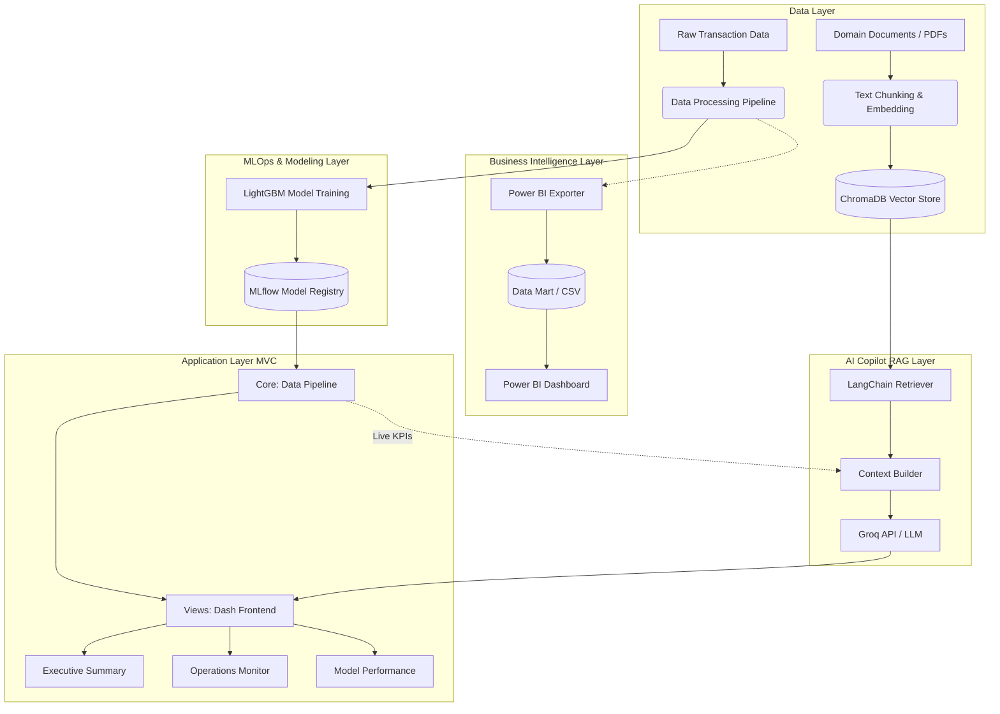

# System Architecture: Fraud Analytics System

This document outlines the architectural design, component interactions, and technology stack of the Fraud Analytics System. The system is designed as an end-to-end enterprise solution, integrating predictive machine learning, real-time operational monitoring, Retrieval-Augmented Generation (RAG) AI capabilities, and Business Intelligence reporting.

---

## 1. High-Level Architecture

The system operates across five distinct layers to ensure separation of concerns, scalability, and maintainability.



---

## 2. Component Breakdown

### 2.1. Data Ingestion & Storage Layer

* **Structured Data (Transactions):** Raw transactional data (`fraudTest.csv`, `fraudTrain.csv`) is ingested and processed using Pandas/NumPy. Processed files are cached in Parquet format for optimized reading.
* **Unstructured Data (Knowledge Base):** Internal compliance documents, incident response SOPs, and dispute guidelines are stored in the `knowledge_base/` directory as PDFs.
* **Vector Database (ChromaDB):** Unstructured text is chunked via `RecursiveCharacterTextSplitter` and converted into vector embeddings using the `all-MiniLM-L6-v2` HuggingFace model. These embeddings are persisted locally in `chroma_db/` for semantic search.

### 2.2. Machine Learning & MLOps Layer

* **Predictive Engine:** A LightGBM classifier handles the core fraud detection, optimized for high precision and fast inference on tabular data.
* **Model Tracking (MLflow):** MLflow operates as the centralized model registry. It tracks training parameters, PR-AUC scores, and artifacts. The application layer dynamically fetches the latest production model threshold and metadata from the MLflow server via REST/HTTP (`localhost:5000`).

### 2.3. Application Layer (MVC Architecture)

The web dashboard is built using Dash and follows a strict Model-View-Controller design pattern to separate business logic from UI rendering.

* **Core (Models/Controllers):**
* `data_pipeline.py`: Handles data loading, MLflow integration, and live KPI calculations (Net Savings, FPR, Fraud Rate).
* `ai_assistant.py`: Manages the prompt engineering and API calls to the LLM.


* **Views (UI Components):**
* `tab_executive.py`: Renders financial metrics and ROI impact.
* `tab_operations.py`: Renders geospatial anomaly mapping and the live investigation queue.
* `tab_performance.py`: Renders the operational confusion matrix and Explainable AI (SHAP) feature importance.
* `tab_ai.py`: Renders the chat interface.


### 2.4. AI Copilot Layer (RAG)

The system features a contextual AI assistant powered by LangChain and Groq.

* **Dual-Context Injection:** When a user queries the AI, the system injects two sources of truth into the system prompt:
1. **Deterministic Data:** Live KPI variables dynamically fetched from `data_pipeline.py`.
2. **Semantic Data:** Top-K relevant document chunks retrieved from ChromaDB using similarity search.


* **Inference:** The context and query are processed by a large context window LLM (e.g., LLaMA 3.1 or Mixtral via Groq API) to generate factual, grounded responses without hallucination.

### 2.5. Business Intelligence Layer

* **Data Mart Generator:** The `report/export_powerbi.py` script acts as a bridge between the ML pipeline and standard BI tools. It transforms the predictive outputs into a flat table (Data Mart), explicitly labeling cases (True Positives, False Positives, etc.).
* **Power BI:** Connects to the exported Data Mart, utilizing DAX measures to build executive dashboards independent of the Python web server.

---

## 3. Technology Stack

| Component | Technology | Purpose |
| --- | --- | --- |
| **Language** | Python 3.10+ | Core programming language |
| **Data Processing** | Pandas, NumPy | Data manipulation and aggregation |
| **Machine Learning** | LightGBM, Scikit-Learn | Fraud classification and evaluation |
| **MLOps** | MLflow | Experiment tracking and model registry |
| **Frontend Framework** | Dash, Dash Bootstrap Components | Interactive web UI development |
| **Data Visualization** | Plotly Express | Geospatial mapping and trend charting |
| **Vector Database** | ChromaDB | Local storage for document embeddings |
| **Embedding Model** | HuggingFace (`all-MiniLM-L6-v2`) | Text-to-vector transformation |
| **LLM Orchestration** | LangChain | RAG pipeline and retriever management |
| **LLM Inference** | Groq API (LLaMA 3.1 / Mixtral) | High-speed generative AI processing |
| **API Serving (Optional)** | FastAPI, Uvicorn | RESTful endpoints for model serving |

---

## 4. Directory Structure Alignment

The architecture enforces strict directory isolation to maintain enterprise-grade organization:

```text
credit-card-fraud-ml/
├── dashboard/
│   ├── 05_Model_Serving/          # FastAPI REST endpoints
│   └── 06_Dashboard/              # Dash Application
│       ├── core/                  # Business logic and AI integration
│       └── views/                 # UI components and tabs
├── dataset/
│   ├── 01_raw/                    # Immutable raw data
│   ├── 02_processed/              # Cleaned ML data
│   └── 03_powerbi/                # Exported data marts for BI
├── knowledge_base/                # Unstructured domain documents (PDFs)
├── chroma_db/                     # Generated vector database (git-ignored)
├── models/                        # Serialized model artifacts
├── mlruns/                        # MLflow tracking data
└── report/                        # BI exporter scripts and .pbix files
```