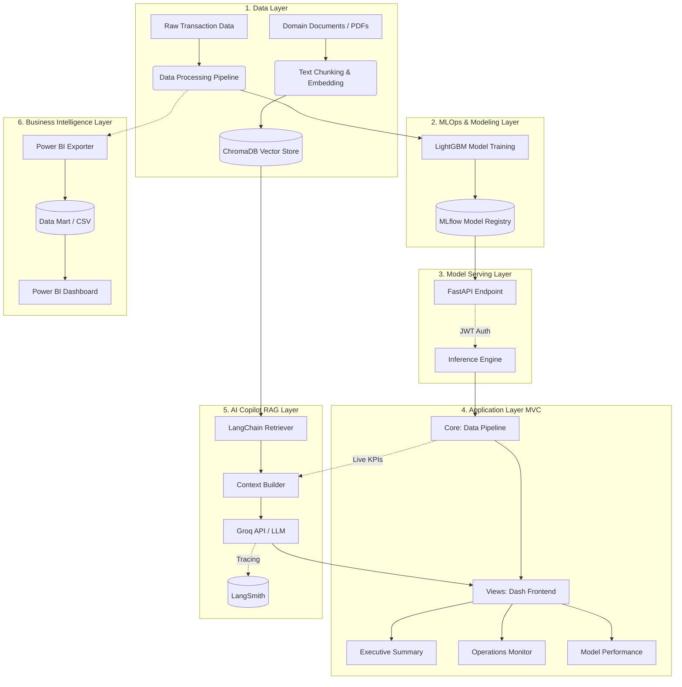

# System Architecture: Risk Fraud Analytics System

This document outlines the architectural design, component interactions, and technology stack of **Risk, the Enterprise Fraud Analytics & Intelligence System**. The system is an end-to-end enterprise solution that integrates predictive machine learning, real-time operational monitoring, Retrieval-Augmented Generation (RAG) AI, and Business Intelligence reporting.

## Table of Contents

1. [High-Level Architecture](#1-high-level-architecture)
2. [Component Breakdown](#2-component-breakdown)
3. [Technology Stack](#3-technology-stack)
4. [Security and CI/CD](#4-security-and-cicd)
5. [Directory Structure](#5-directory-structure)

---

## 1. High-Level Architecture

The system operates across six distinct layers to ensure separation of concerns, scalability, and maintainability.

| # | Layer | Responsibility |
| --- | --- | --- |
| 1 | **Data Layer** | Ingestion of transaction data and documents, plus vector storage. |
| 2 | **MLOps & Modeling Layer** | Model training, tracking, and registration. |
| 3 | **Model Serving Layer** | JWT-secured FastAPI inference endpoints. |
| 4 | **Application Layer (MVC)** | Dash dashboard for executives, operations, and auditors. |
| 5 | **AI Copilot (RAG) Layer** | Contextual assistant grounded in internal documents and live KPIs. |
| 6 | **Business Intelligence Layer** | Data Mart and Power BI dashboards. |



---

## 2. Component Breakdown

### 2.1. Data Ingestion & Storage Layer

| Data Type | Source / Location | Processing |
| --- | --- | --- |
| **Structured data (transactions)** | `fraudTrain.csv`, `fraudTest.csv` | Processed with Pandas/NumPy, then cached in Parquet format for faster reads. |
| **Unstructured data (knowledge base)** | `knowledge_base/` folder (PDFs) containing compliance documents, incident response SOPs, and dispute guidelines. | Chunked with `RecursiveCharacterTextSplitter`. |
| **Vector database** | `chroma_db/` (local persistence) | Text chunks are converted into embeddings with the HuggingFace `all-MiniLM-L6-v2` model for semantic search. |

### 2.2. Machine Learning & MLOps Layer

* **Predictive Engine:** A **LightGBM** classifier handles the core fraud detection, optimized for high precision and fast inference on tabular data.
* **Model Tracking (MLflow):** Operates as the centralized model registry. It tracks training parameters, PR-AUC scores, and artifacts. The application layer fetches the latest production model threshold and metadata from the MLflow server via REST/HTTP (`localhost:5000`).

### 2.3. Model Serving Layer

* **FastAPI + Uvicorn** provide RESTful endpoints for model inference.
* **JWT (JSON Web Token)** secures the prediction endpoints against unauthorized access. The secret key is managed through the `API_SECRET_KEY` environment variable.

### 2.4. Application Layer (MVC Architecture)

The web dashboard is built with Dash and follows a Model-View-Controller pattern to separate business logic from UI rendering.

**Core (Models/Controllers)**

| File | Responsibility |
| --- | --- |
| `data_pipeline.py` | Data loading, MLflow integration, and live KPI calculations (Net Savings, FPR, Fraud Rate). |
| `ai_assistant.py` | Prompt engineering and LLM API calls. |

**Views (UI Components)**

| File | Responsibility |
| --- | --- |
| `tab_executive.py` | Financial metrics and ROI impact. |
| `tab_operations.py` | Geospatial anomaly mapping and the live investigation queue. |
| `tab_performance.py` | Operational confusion matrix and Explainable AI (SHAP) feature importance. |
| `tab_ai.py` | AI Copilot chat interface. |

### 2.5. AI Copilot Layer (RAG)

The contextual AI assistant is powered by LangChain and Groq.

**Dual-Context Injection.** When a user submits a query, the system injects two sources of truth into the system prompt:

1. **Deterministic Data:** live KPI variables from `data_pipeline.py`.
2. **Semantic Data:** the top-K most relevant document chunks retrieved from ChromaDB via similarity search.

**Inference.** The context and query are processed by a large-context-window LLM (for example LLaMA 3.1 or Mixtral via the Groq API) to produce factual, grounded responses and reduce the risk of hallucination.

**Monitoring.** **LangSmith** traces assistant queries, including latency and token cost.

### 2.6. Business Intelligence Layer

* **Data Mart Generator:** The `report/export_powerbi.py` script bridges the ML pipeline and standard BI tools. It transforms predictive outputs into a flat table (Data Mart) with explicitly labeled cases (True Positives, False Positives, etc.).
* **Power BI:** Connects to the exported Data Mart and uses DAX measures to build executive dashboards that run independently of the Python web server.

---

## 3. Technology Stack

| Component | Technology | Purpose |
| --- | --- | --- |
| **Language** | Python 3.10+ | Core programming language |
| **Data Processing** | Pandas, NumPy, Parquet | Data manipulation and aggregation |
| **Machine Learning** | LightGBM, Scikit-Learn | Fraud classification and evaluation |
| **Explainable AI** | SHAP | Global and local model explanations |
| **MLOps** | MLflow | Experiment tracking and model registry |
| **Frontend Framework** | Dash, Dash Bootstrap Components | Interactive web UI development |
| **Data Visualization** | Plotly Express | Geospatial mapping and trend charts |
| **Vector Database** | ChromaDB | Local storage for document embeddings |
| **Embedding Model** | HuggingFace (`all-MiniLM-L6-v2`) | Text-to-vector transformation |
| **LLM Orchestration** | LangChain | RAG pipeline and retriever management |
| **LLM Inference** | Groq API (LLaMA 3.1 / Mixtral) | High-speed generative AI processing |
| **LLM Monitoring** | LangSmith | Tracing, latency, and token cost |
| **API Serving** | FastAPI, Uvicorn | RESTful model serving endpoints |
| **Security** | JWT | Inference endpoint authentication |
| **Business Intelligence** | Power BI, Python export script | Executive dashboards and Data Mart |
| **Containerization** | Docker, Docker Compose | Integrated deployment |

---

## 4. Security and CI/CD

| Aspect | Implementation |
| --- | --- |
| **Secrets Management** | `.env` file for local use (never committed) and GitHub Secrets for CI/CD. |
| **Security Scanning** | Gitleaks prevents leakage of static API keys. |
| **Code Quality** | Flake8 (linting), Black (formatting), MyPy (type checking). |
| **Automated Testing** | Pytest for data pipeline logic and Haversine calculations. |
| **Continuous Deployment** | GitHub Actions builds Docker images and publishes them to GitHub Container Registry (GHCR). |

---

## 5. Directory Structure

The architecture enforces strict directory isolation to maintain enterprise-grade organization.

```text
credit-card-fraud-ml/
├── .github/workflows/             # CI/CD pipelines
├── dashboard/
│   ├── 05_Model_Serving/          # FastAPI REST endpoints
│   └── 06_Dashboard/              # Dash application
│       ├── core/                  # Business logic and AI integration
│       └── views/                 # UI components and tabs
├── dataset/
│   ├── 01_raw/                    # Immutable raw data
│   ├── 02_processed/              # Cleaned ML data
│   └── 03_powerbi/                # Exported data marts for BI
├── docs/                          # System documentation
├── knowledge_base/                # Unstructured domain documents (PDFs)
├── chroma_db/                     # Generated vector database (git-ignored)
├── models/                        # Serialized model artifacts
├── mlruns/                        # MLflow tracking data
├── notebook/                      # Research (EDA, A/B Testing, XAI)
├── report/                        # BI scripts, .pbix files, and image assets
└── tests/                         # Unit tests (Pytest)
```